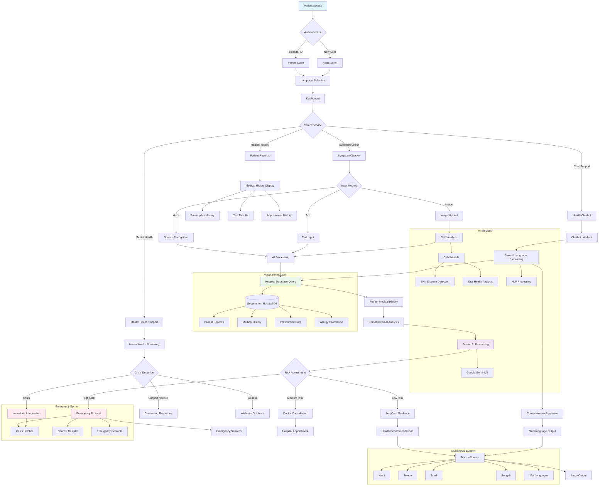

# 🏥 Sarathi AI - Rural Healthcare Assistant

**AI-powered multilingual health companion for rural communities**

[](https://hackathon.com)
[](https://manipal.edu)
[](https://github.com/team-edu-freaks)

## 🎯 Problem Statement (AM-01)

**Design a platform based on Artificial Intelligence to improve preventive, promotive, curative and rehabilitative healthcare for rural population.**

## 👥 Team EDU-FREAKS

- **Nishant A. Isloor** - Data Science and Engineering
- **Keerthan Kumar C.** - Data Science and Engineering  
- **Vishal Vaibhav** - Data Science and Engineering
- **Mahesh Soni** - Computer and Communication Engineering

## 🌟 Project Overview

Sarathi AI bridges the healthcare gap in rural India by providing an AI-powered, multilingual healthcare assistant that integrates with government hospital systems. Our solution offers personalized healthcare guidance using patient medical history while ensuring cultural sensitivity and accessibility.

### 🎯 Key Innovation

**Hospital Integration Approach**: Unlike generic health apps, Sarathi AI partners with government hospitals to access patient medical records, enabling highly personalized and contextual healthcare recommendations.

## Project Format



## Project Structure

```
sarathiai/
├── src/
│   ├── app/                    # Next.js app directory
│   │   ├── api/                # API routes
│   │   │   ├── gemini/         # Gemini AI integration
│   │   │   └── results/        # Health analysis results
│   │   ├── chatbot/            # AI chatbot interface
│   │   ├── dashboard/          # Main dashboard
│   │   ├── symptom-checker/    # Symptom analysis tool
│   │   ├── mentalhealth/       # Mental health resources
│   │   ├── medicalhistory/     # Patient history management
│   │   ├── prescriptions/      # Prescription tracking
│   │   └── tests/              # Medical test results
│   ├── components/             # Reusable UI components
│   │   ├── ui/                 # Base UI components
│   │   ├── voice-input.tsx     # Voice recording component
│   │   ├── image-upload.tsx    # Image analysis component
│   │   ├── results.tsx         # Health analysis results
│   │   └── symptom-categories.tsx
│   ├── hooks/                  # Custom React hooks
│   ├── lib/                    # Utility functions
│   └── keys/                   # API keys and configuration
├── cnn models/                 # Python ML models
│   ├── skin_model.h5          # Skin condition detection
│   ├── oral_disease_model.h5  # Oral disease detection
│   └── app.py                 # Flask model server
├── symptom_query_api/         # Symptom analysis API
│   └── app.py                 # Flask symptom processing
└── public/                    # Static assets
```

## ✨ Features

### 🩺 Core Healthcare Features

- **AI-Powered Symptom Checker**: Analyze symptoms using voice, text, and image inputs
- **Personalized Healthcare**: Leverages patient medical history from partner hospitals
- **Multilingual Support**: Available in 12+ Indian languages
- **Interactive Health Chatbot**: Context-aware AI assistant with voice support
- **Medical History Integration**: Seamless access to patient records from government hospitals
- **Mental Health Support**: Counseling resources and crisis intervention

### 🌟 Advanced Capabilities

- **Voice Input**: Natural language symptom description in native languages
- **Image Analysis**: Visual symptom assessment using CNN models
- **Cultural Sensitivity**: Advice tailored for rural Indian communities
- **Emergency Support**: Crisis helpline integration and immediate guidance
- **Text-to-Speech**: Audio playback in multiple regional languages
- **Offline Capability**: Basic functionality without internet connectivity

## 🏗️ System Architecture

### Hospital Integration Model

```
Government Hospital → Patient Database → Sarathi AI → Personalized Healthcare
```

Our system integrates with government hospital databases to provide:

- **Patient Medical History Access**
- **Prescription History**
- **Previous Diagnosis Records**
- **Allergy Information**
- **Family Medical History**

## 🛠️ Tech Stack

### Frontend

- **Next.js 14**: React framework with App Router
- **TypeScript**: Type-safe development
- **Tailwind CSS**: Responsive, utility-first styling
- **Radix UI**: Accessible component library
- **Lucide React**: Comprehensive icon library

### Backend & AI

- **Google Gemini AI**: Advanced health analysis and personalized recommendations
- **CNN Models**: Medical image analysis (skin conditions, oral diseases)
- **Flask APIs**: Python backend for symptom analysis
- **Speech Recognition**: Multi-language voice processing
- **Hospital Database Integration**: Secure patient data access

### Tools & Libraries

- **React Hook Form**: Efficient form management
- **React Markdown**: Rich text rendering
- **Google Text-to-Speech**: Text-to-speech functionality
- **Google Speech-to-Text**: Voice-to-text conversion
- **Google Translate**: Real-time multi-language support
- **Database Connectors**: Hospital system integration

## 🔄 System Workflow

### Patient Journey

1. **Authentication**: Patient login using hospital ID
2. **Language Selection**: Choose preferred regional language
3. **Symptom Input**: Voice/text/image symptom description
4. **AI Analysis**: Context-aware analysis using medical history
5. **Personalized Recommendations**: Tailored advice based on patient profile
6. **Follow-up**: Integration with hospital appointment system

## 🧠 AI & Machine Learning

### Models Implementation

- **Natural Language Processing**: Multi-language symptom analysis
- **Computer Vision**: Medical image classification
- **Personalization Engine**: Patient history-based recommendations
- **Risk Assessment**: Priority scoring based on medical history

### CNN Models

- **Skin Disease Detection**: Dermatological condition identification
- **Oral Health Analysis**: Dental and oral disease detection
- **Medical Document OCR**: Prescription and report digitization (Future scope)

## 🌍 Multilingual Support

### Supported Languages

**Primary**: English, Hindi, Bengali, Telugu, Tamil
**Extended**: Marathi, Gujarati, Kannada, Malayalam, Punjabi, Odia, Assamese, Urdu

### Localization Features

- Real-time content translation
- Voice synthesis in native languages
- Cultural adaptation of health advice
- Region-specific emergency information

## 🏥 Healthcare Impact

### Rural-Specific Solutions

- **Limited Access Considerations**: Offline capabilities for poor connectivity areas
- **Traditional Medicine Integration**: Bridging modern and traditional healthcare
- **Government Policy Alignment**: Compliance with rural healthcare initiatives
- **Emergency Response**: Quick access to nearest healthcare facilities

### Patient Benefits

- **24/7 Healthcare Access**: Round-the-clock health guidance
- **Personalized Care**: Medical history-informed recommendations
- **Language Barrier Removal**: Native language support
- **Cost-Effective**: Reduced unnecessary hospital visits

## 🚀 Installation & Setup

### Prerequisites

```bash
Node.js 18+
Python 3.8+
Google Gemini API key
Hospital Database Access Credentials
```

### Frontend Setup

```bash
# Clone repository
git clone https://github.com/Keerthan04/Sarathi.AI-Your-AI-powered-health-Companion
cd Sarathi.AI-Your-AI-powered-health-Companion

# Install dependencies
npm install

# Set up environment variables
cp .env.example .env
# Add your API keys and database credentials

# Run development server
npm run dev
```

### Backend Setup

```bash
# Navigate to backend directory
cd cnn models

# Create virtual environment
python -m venv venv
source venv/bin/activate  # On Windows: venv\Scripts\activate

# Install dependencies
pip install -r requirements.txt

# Run Flask server
python app.py #one model api run
python main.py #run on another terminal the other model api
```

### Environment Variables

```env
GEMINI_API_KEY= get the API key from Google Cloud
GOOGLE_API_KEY= get the API key from Google Cloud
QUERY_BACKEND_URL=http://localhost:5000/predict
SKIN_BACKEND_URL=http://localhost:6000/cnn-predict
MOUTH_BACKEND_URL=http://localhost:7000/cnn-predict-mouth
# Do not expose your Neon credentials to the browser

DATABASE_URL= neon database credentials, contact me for access
```

## 📱 Core Components

### Symptom Checker (`/symptom-checker`)

Multi-modal symptom analysis with:

- Voice input processing
- Image upload and analysis
- Medical history integration
- Personalized recommendations

### Health Chatbot (`/chatbot`)

Context-aware AI assistant featuring:

- Patient medical history awareness
- Natural language conversations
- Multi-language support
- Emergency detection and response

### Patient Dashboard (`/dashboard`)

Comprehensive health management:

- Medical history timeline
- Prescription tracking
- Appointment scheduling
- Health metrics monitoring

### Mental Health Support (`/mental-health`)

Comprehensive mental wellness:

- Crisis intervention resources
- Counseling referrals
- Mental health screening
- Family support guidance

## 🎯 Hackathon Achievements

### Innovation Highlights

- **Hospital Integration**: First-of-its-kind government hospital partnership model
- **Personalized AI**: Medical history-informed healthcare recommendations
- **Rural Focus**: Specifically designed for underserved communities
- **Cultural Sensitivity**: Deep integration of local healthcare practices

### Technical Excellence

- **Scalable Architecture**: Microservices-based design
- **Multi-modal AI**: Voice, text, and image processing
- **Real-time Translation**: 12+ Indian languages supported
- **Offline Capability**: Essential features work without internet

## 🚀 Future Roadmap

### Phase 1 (Immediate)

- [ ] Government hospital pilot program
- [ ] Regional language expansion
- [ ] Basic telemedicine integration

### Phase 2 (6 months)

- [ ] Wearable device integration
- [ ] Predictive health analytics
- [ ] Community health worker portal

### Phase 3 (1 year)

- [ ] National healthcare system integration
- [ ] AI-powered drug discovery insights
- [ ] Population health analytics

## 🤝 Contributing

We welcome contributions from the healthcare and technology community!

## 📊 Project Metrics

### Impact Potential

- **Target Users**: 65% of India's rural population (900M+ people)
- **Healthcare Gap**: Address 70% shortage of doctors in rural areas
- **Cost Reduction**: 40% reduction in unnecessary hospital visits
- **Language Barrier**: Eliminate communication issues for 80% of rural patients

## 📞 Contact

### Team Contact

- **Email**: <ckeerthankumar4@gmail.com>
- **Phone**: +91 9591124158

### Acknowledgments

- **Hack To Future 2.0** - GOGTE Institute of Technology, Belagavi
- **TCS** - Knowledge Partner and Technology Support
- **Government of India** - Rural Healthcare Mission
- **Open Source Community** - Libraries and frameworks used
